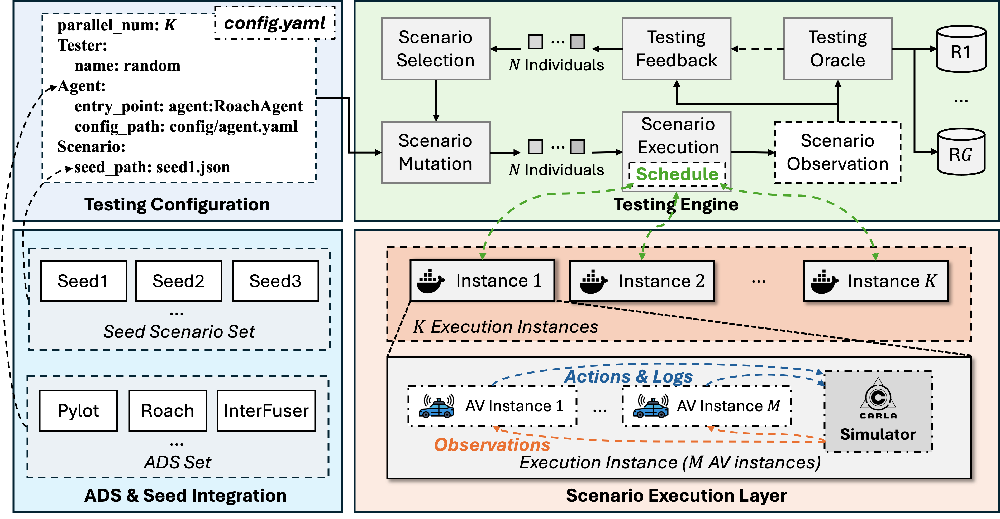
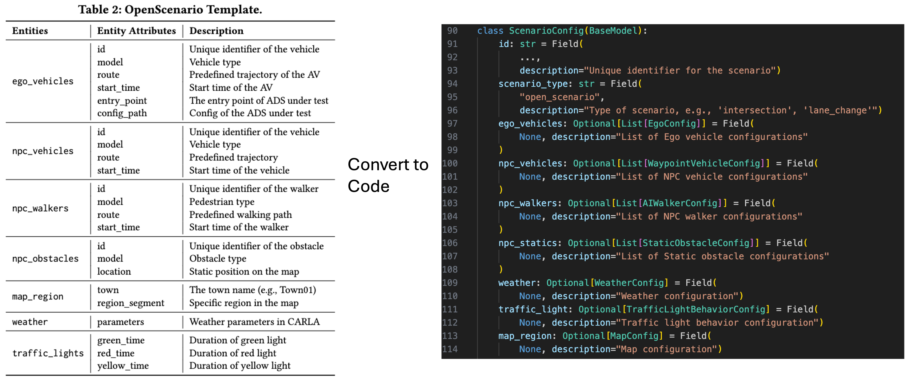

<p align="center">
  
</p>

<br />
<div align="center">
  <h1 align="center">Drivora</h1>
  <p align="center">
    <b>A Unified and Extensible Infrastructure for Autonomous Driving Testing</b>
  </p>
</div>

---

## 🧭 Overview

**Drivora** is a research-oriented infrastructure for **search-based testing of Autonomous Driving Systems (ADSs)**.  
It is designed to support:

- 🚗 Diverse **state-of-the-art ADS architectures**  
- 🧪 A variety of **advanced ADS testing techniques**  
- ⚡ **Distributed and parallel execution** for large-scale testing  
- 👥 **Multi-agent and multi-vehicle** testing settings  

Drivora enables **unified, extensible, and automated testing** of ADS safety and reliability across complex driving scenarios. Its modular design allows researchers to **prototype and extend new testing methods** without dealing with low-level deployment details. 

If you find **Drivora** useful, please consider giving it a ⭐ on GitHub! Thank you!

<p align="center">
  
</p>


## 🚀 Features

- 🔬 **Fuzzing/Testing**  
  Built-in support for diverse scenario fuzzing and adversarial scenario generation.

- 🧩 **ADS-Agnostic Integration**  
  Containerized interfaces for black-box and white-box ADSs.

- ⚡ **Distributed & Parallel Execution**  
  Scale up testing across multiple scenario execution instances.

- 👥 **Multi-Agent Testing**  
  Supports multi-vehicle evaluation with coordinated or independent ADS behaviors.


## 📦 Getting Started

### Hardware Requirements

- The testing engine itself requires relatively modest resources.  
- For simulation requirements, please refer to the [CARLA recommendations](https://github.com/carla-simulator/carla?tab=readme-ov-file#recommended-system).  
- Most ADSs are evaluated on NVIDIA A5000 (24 GB) and L40 (48 GB) GPUs.  


### Prerequisites
- [Docker](https://www.docker.com/)  
- [Anaconda](https://www.anaconda.com/) (recommended)
- [CUDA](https://developer.nvidia.com/cuda-toolkit-archive) **11.x** (ensure that the path `/usr/local/cuda-11` exists)

### Clone the Repository
```bash
git clone https://github.com/MingfeiCheng/Drivora.git
cd Drivora
```

### 📂 Directory Structure

```
Carla/
├── agent_corpus/       # ADSs under test
├── fuzzer/             # Fuzzing tools and logic
├── pkgs/               # Environment packages
├── registry/           # Dynamic component loading
├── scenario_corpus/    # Scenario templates / DSLs
├── scenario_elements/  # Low-level scenario behavior nodes
├── scenario_runner/    # Scenario execution components
├── seed_generator/     # Seed scenario generation
├── tools/              # Helper scripts
├── scripts/            # Demo usage scripts
├── config.yaml         # Main configuration
├── install.sh          # Quick install script
└── start_fuzzer.py     # Entrypoint for launching tests
```


### ⚙️ Installation

Different ADSs and testing techniques often depend on heterogeneous libraries, which may cause dependency conflicts. We provide a quick script for installation: 

```bash
bash install.sh [ads_name] [tester_name] [carla_version]
```

- **First parameter** → ADS under test (e.g., `roach`)  
- **Second parameter** → Testing method (e.g., `random`)  
- **Third parameter** → Compatible CARLA version (check official repo of each ADS for supported versions)

For example, to test **Roach** under **Random** testing with CARLA `0.9.10.1`, you can run
```bash
bash install.sh roach random 0.9.10.1
```

> ⚠️ Some installations may require `sudo` due to HuggingFace cache permissions, in which case you will need to enter your password manually.


## 🚦 Usage (Quick Demo)

### Step 1: Generate Seed Scenarios
```bash
python -m seed_generator.open_scenario \
  --num 10 --town Town01 \
  --min_length 50 --max_length 100 \
  --out_dir scenario_datasets \
  --image carlasim/carla:0.9.10.1
```

This generates 10 initial seeds under `scenario_datasets`, e.g.:

```
scenario_datasets/open_scenario/0.9.10.1/route_100_200/Town01_0001.json
scenario_datasets/open_scenario/0.9.10.1/route_100_200/Town01_0002.json
...
```

### Step 2: Run Testing

You can configure testing for any seed scenario and ADS by editing the demo scripts in `scripts/`. As a quick example, here is how to run **Random testing** on **Roach** with an initial seed:

```bash
bash scripts/demo_roach.sh
```
We also provide a collection of scripts for different testing methods and ADSs under the `scripts/` directory with default settings.
You can edit and adapt any of them for your experiments.


## 🚗 ADS Corpus

Currently, **12 ADSs** are supported, covering **module-based**, **end-to-end**, and **vision-language-based** systems.  
Below is an overview of the supported agents and their default configurations:

| ADS Agent  | ADS Type              | Original Repository                                                                                   | Entry Point                                           | Config Path                                                                 |
|------------|-----------------------|-------------------------------------------------------------------------------------------------------|-------------------------------------------------------|------------------------------------------------------------------------------|
| Roach      | End-to-End            | [carla-roach](https://github.com/zhejz/carla-roach)                                                   | `agent_corpus.roach.agent:RoachAgent`                 | `agent_corpus/roach/config/config_agent.yaml`                                |
| LAV        | End-to-End            | [LAV](https://github.com/dotchen/LAV)                                                                 | `agent_corpus.lav.lav_agent:LAVAgent`                 | `agent_corpus/lav/config_v2.yaml`                                           |
| InterFuser | End-to-End            | [InterFuser](https://github.com/opendilab/InterFuser)                                                 | `agent_corpus.interfuser.interfuser_agent:InterfuserAgent` | `agent_corpus/interfuser/interfuser_config.py`                               |
| TransFuser | End-to-End            | [TransFuser](https://github.com/autonomousvision/transfuser)                                          | `agent_corpus.transfuser.agent:HybridAgent`           | `agent_corpus/transfuser/model_ckpt/models_2022/transfuser`                  |
| PlanT      | End-to-End            | [PlanT](https://github.com/autonomousvision/plant)                                                    | `agent_corpus.plant.PlanT_agent:PlanTPerceptionAgent` | `agent_corpus/plant/carla_agent_files/config/experiments/PlanTSubmission.yaml` |
| TCP        | End-to-End            | [TCP](https://github.com/OpenDriveLab/TCP), [Bench2Drive](https://github.com/Thinklab-SJTU/Bench2Drive/tree/main) | `agent_corpus.tcp_admlp.tcp_b2d_agent:TCPAgent`       | `agent_corpus/tcp_admlp/Bench2DriveZoo/tcp_b2d.ckpt`                         |
| ADMLP      | End-to-End            | [ADMLP](https://github.com/E2E-AD/AD-MLP), [Bench2Drive](https://github.com/Thinklab-SJTU/Bench2Drive/tree/main) | `agent_corpus.tcp_admlp.admlp_b2d_agent:ADMLPAgent`   | `agent_corpus/tcp_admlp/Bench2DriveZoo/admlp_b2d.ckpt`                       |
| UniAD      | End-to-End            | [UniAD](https://github.com/OpenDriveLab/UniAD), [Bench2Drive](https://github.com/Thinklab-SJTU/Bench2Drive/tree/main) | `agent_corpus.uniad_vad.uniad_b2d_agent:UniadAgent`   | `agent_corpus/uniad_vad/adzoo/uniad/configs/stage2_e2e/base_e2e_b2d.py+agent_corpus/uniad_vad/Bench2DriveZoo/uniad_base_b2d.pth` |
| VAD        | End-to-End            | [VAD](https://github.com/hustvl/VAD), [Bench2Drive](https://github.com/Thinklab-SJTU/Bench2Drive/tree/main) | `agent_corpus.uniad_vad.vad_b2d_agent:VadAgent`       | `agent_corpus/uniad_vad/adzoo/vad/configs/VAD/VAD_base_e2e_b2d.py+agent_corpus/uniad_vad/Bench2DriveZoo/vad_b2d_base.pth` |
| Simlingo   | Vision-Language-based | [Simlingo](https://github.com/RenzKa/simlingo)                                                        | `agent_corpus.simlingo.agent_simlingo:LingoAgent`     | `agent_corpus/simlingo/checkpoint/simlingo/checkpoints/epoch=013.ckpt/pytorch_model.pt` |
| Orion      | Vision-Language-based | [Orion](https://github.com/xiaomi-mlab/Orion)                                                         | `agent_corpus.orion.orion_b2d_agent:OrionAgent`       | `agent_corpus/orion/adzoo/orion/configs/orion_stage3_agent.py+agent_corpus/orion/ckpts/Orion.pth`                                                   |
| Pylot      | Module-based          | [pylot](https://github.com/erdos-project/pylot)                                                       | *Will be released soon*                              | *Will be released soon*                                                     |

📌 See the [Agent Corpus](agents/README.md) for more details and instructions on integrating your own ADS.

## 🔬 Fuzzing/Testing Tools

Drivora incorporates multiple ADS fuzzers, each with different scenario definitions, mutation strategies, feedback, and oracles.

✅ **Currently Supported Tools**
- [Random](fuzzer/open_scenario/random)  
- [AVFuzzer](fuzzer/open_scenario/avfuzzer)  
- [Behavexplor](fuzzer/open_scenario/behavexplor)  
- [SAMOTA](fuzzer/open_scenario/samota)  
- [DriveFuzz](fuzzer/open_scenario/drivefuzz)
- ... 🔄 more coming soon!

⚠️ **Note**: We cannot guarantee that the performance reproced by Drivora will be fully consistent with the results in the original papers, as different platforms may lead to variations.  Some components are still under development — we will continue to update the repository and address issues over time.

### 🧩 Extension

To develop your own **search-based testing methods**, please refer to the provided examples and associated papers.

## 🎬 Scenario Definition

Scenarios are essential for testing. In **Drivora**, we define a scenario format called **OpenScenario**, which directly uses low-level actionable parameters (see the figure below). This template is flexible enough to cover most testing requirements. Drivora also supports extensions with other scenario formats, though some additional effort may be required — see [scenario_corpus](scenario_corpus/README.md) for details.

<p align="center">
  
</p>

## ✅ TODO

- [ ] Provide more detailed **documentation and tutorials**  
- [ ] Release more testing methods
- [ ] Release more ADSs

## 🤝 Contributing

Contributions of all kinds are welcome! We encourage opening an issue first for discussion. Once confirmed, you can submit a Pull Request.  

1. Fork this repository  
2. Create a new branch  
3. Commit and push your changes  
4. Open a Pull Request  


## 📖 Citation

If you use **Drivora** in your work, please cite the framework and the corresponding testing methods:

```bibtex
@article{cheng2024drivetester,
  title     = {Drivetester: A unified platform for simulation-based autonomous driving testing},
  author    = {Cheng, Mingfei and Zhou, Yuan and Xie, Xiaofei},
  journal   = {arXiv preprint arXiv:2412.12656},
  year      = {2024}
}

@article{cheng2025stclocker,
  title     = {STCLocker: Deadlock Avoidance Testing for Autonomous Driving Systems},
  author    = {Cheng, Mingfei and Wang, Renzhi and Xie, Xiaofei and Zhou, Yuan and Ma, Lei},
  journal   = {arXiv preprint arXiv:2506.23995},
  year      = {2025}
}
```
📌 We will provide an improved .bib file for easier citation in the future. Thank you!


## Acknowledgements

We would like to acknowledge the following open-source projects and communities that our work builds upon:

- All open-source Autonomous Driving Systems (ADSs)
- [CARLA ScenarioRunner](https://github.com/carla-simulator/scenario_runner)
- [CARLA Leaderboard](https://github.com/carla-simulator/leaderboard)

This project builds on our previous research contributions, including:  

- **BehAVExplor** — ISSTA 2023  
- **Decictor** — ICSE 2025  
- **MoDitector** — ISSTA 2025  
- **STCLocker** — Preprint  
- **ADReFT** — Preprint  


## 📝 Contact & License

We welcome issues, suggestions, and collaboration opportunities.  
For inquiries, please contact **Mingfei Cheng** at [snowbirds.mf@gmail.com](mailto:snowbirds.mf@gmail.com).  

This project is licensed under the [MIT License](LICENSE).  
© 2024 Mingfei Cheng
